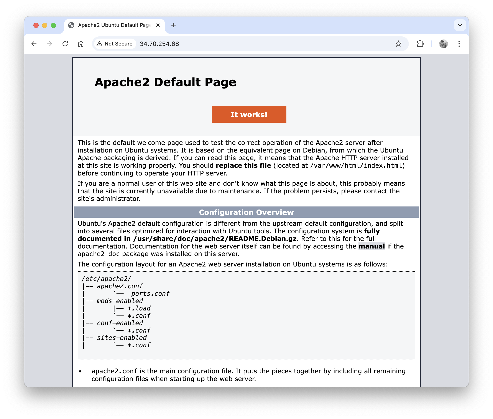

# PDFer

A basic API tool that creates PDFs from HTML or a URL.

> This application is currently live at:  
> https://pdfer.codeadam.ca

This tool uses a basic Laravel app with Browsershot and Puppeteer to generate PDFs. Here are the steps to create a new Google Cloud E2 server and install the necessary libraries.

1. Login to the [GCP Console](https://console.cloud.google.com/) and create a new E2 server using Ubuntu 22 LTS x86/64. Open HTTP and HTTPS in the Networking tab.
2. Change the IP address to a static IP.
3. Open up the GCP SSH tool and run a few update and upgrade commands:

    ```
    sudo apt update
    sudo apt upgrade
    sudo apt autoremove
    ```

4. Install Apache using these commannds:

    ```
    sudo apt install apt-utils 
    sudo apt install apache2 apache2-utils 
    sudo service apache2 restart
    ```

    At this point you can enter your IP address (use http://) into a browser and you should see the default Apache page:

    

5. Using a terminal (Mac) create an SSH key:

    ```
    ssh-keygen -t rsa -b 4096 -C username
    ```

    Add the public key to the Google Cloud Platform Metadata.

    Setup a new FileZilla SFTP connection. Add the IP address, username, and privat key file. Add the new user from the new SSH key to the `www-data` user group. Change any contents of the `/var/www/ folder to have user write permissions using `0775`.

6. Install and configure MySQL:

    ```
    sudo apt-get install mysql-server
    sudo mysql_secure_installation
    ```

    ```
    sudo mysql
    ```

    ```
    ALTER USER 'root'@'localhost' IDENTIFIED WITH mysql_native_password BY "password";
    exit
    ```
    
7. Insall PHP:

    ```
    sudo apt update
    sudo add-apt-repository ppa:ondrej/apache2
    sudo add-apt-repository ppa:ondrej/php
    sudo apt install php8.3
    ```

    And all required PHP libraries:

    ```
    sudo apt-get install -y php8.3-cli php8.3-common php8.3-mysql php8.3-zip php8.3-gd
    sudo apt-get install -y php8.3-mbstring php8.3-curl php8.3-xml php8.3-bcmath
    ```
    
8. Install [Composer](https://getcomposer.org/):

    ```
    curl -sS https://getcomposer.org/installer -o /tmp/composer-setup.php
    sudo php /tmp/composer-setup.php --install-dir=/usr/local/bin --filename=composer
    ```

    And confirm Composer is installed:

    ```
    compoer --version
    ```
    
9. Install [GIT](https://git-scm.com/):

    ```
    sudo apt install git-all
    sudo apt-get install install-info
    ```

    And comfirm Git is installed:

    ```
    git --version
    ```

10. Change the server password:  
    
    ```
    sudo passwd
    sudo apt update
    sudo apt upgrade
    ```
    
    And reboot:

    ```
    sudo reboot
    ```

11. Install [Webmin](https://webmin.com/):

    ```
    curl -fsSL https://download.webmin.com/jcameron-key.asc | sudo gpg --dearmor -o /usr/share/keyrings/webmin.gpg
    ```

    Then open up the `sources.list` file:

    ```
    sudo nano /etc/apt/sources.list
    ```

    And add this lkine to the ver bottom:

    ```
    deb [signed-by=/usr/share/keyrings/webmin.gpg] http://download.webmin.com/download/repository sarge contrib
    ```

    And intall Webmin:

    ```
    sudo apt update
    sudo apt install webmin
    ```
    
    Open up port 10000:

    ```
    sudo ufw allow 10000
    ```

    And open port 10000 in the VPC Network GCP console.

    Reboot the server:

    ```
    sudo reboot
    ```
    
12. Install an SSL using [LedtsEncrypt](https://letsencrypt.org/):

    ```
    sudo apt install certbot python3-certbot-apache  
    sudo certbot
    ```

13. Ad a virtual host using Webmin:

    Port 80:
    
    ```
    <Directory "/var/www/academicintegrity.codeadam.ca">
        allow from all
        Require all granted
        AllowOverride All
    </Directory>
    RewriteEngine on
    RewriteCond %{SERVER_NAME} =academicintegrity.codeadam.ca
    RewriteRule ^ https://%{SERVER_NAME}%{REQUEST_URI} [END,NE,R=permanent]
    ```
    
    Port 443:
    
    ```
    <Directory /var/www/pdfer.codeadam.ca/public>
        AllowOverride All
        Options None
        Require all granted
    </Directory>
    SSLCertificateFile /etc/letsencrypt/live/pdfer.codeadam.ca/fullchain.pem
    SSLCertificateKeyFile /etc/letsencrypt/live/pdfer.codeadam.ca/privkey.pem
    Include /etc/letsencrypt/options-ssl-apache.conf
    ```

13. Clone the PDFer repo:

    ```
    sudo git clone https://github.com/codeadamca/pdfer
    ```

    Change ownership to Google user: thomasadam83
    
    Rename folder to pffer.codeadam.ca
    Point virtual servers to public folder

14. Error reporting:

    ```
    /etc/php/8.3/apache2/php.ini
    Line 518: display_errors = On
    ```

    Restart Apache using `sudo service apache2 restart`.

15. Install Composer php libraries:

    ```
    composer install
    ```

16. Add a `.env` file for the application and make the following changes:

    ```
    DB_CONNECTION=null
    SESSION_DRIVER=file
    ```
    
    Generate an application key:
    
    ```
    php artisan key:generate
    ```

17. Istall NVM:

    https://www.geeksforgeeks.org/how-to-install-nvm-on-ubuntu-22-04/
    
    sudo apt-get update
    
    curl -o- https://raw.githubusercontent.com/nvm-sh/nvm/v0.39.1/install.sh | bash
    
    Terminal must are restarted
    
    nvm --version
    
    ```
    export NVM_DIR="$HOME/.nvm"
    [ -s "$NVM_DIR/nvm.sh" ] && \. "$NVM_DIR/nvm.sh"
    [ -s "$NVM_DIR/bash_completion" ] && \. "$NVM_DIR/bash_completion"
    ```

    nvm install --lts

    cd /var/www/pdfer.codeadam.ca
    npm i

18. Change permissions.

Add www-data to thomasadam83 group
Change ownership of storage folder to www-data recursively

19) Add npm and node to paths

n=$(which node);n=${n%/bin/node}; chmod -R 755 $n/bin/*; sudo cp -r $n/{bin,lib,share} /usr/local

sudo reboot

20) Install Puppeteer and dependencies:

sudo apt install ca-certificates fonts-liberation libasound2 libatk-bridge2.0-0 libatk1.0-0 libc6 libcairo2 libcups2 libdbus-1-3 libexpat1 libfontconfig1 libgbm1 libgcc1 libglib2.0-0 libgtk-3-0 libnspr4 libnss3 libpango-1.0-0 libpangocairo-1.0-0 libstdc++6 libx11-6 libx11-xcb1 libxcb1 libxcomposite1 libxcursor1 libxdamage1 libxext6 libxfixes3 libxi6 libxrandr2 libxrender1 libxss1 libxtst6 lsb-release wget xdg-utils

sudo npm install --location=global --unsafe-perm puppeteer --ignore-scripts

// npx puppeteer browsers install chrome
// sudo apt-get -y chromium-browser

cd /var/www/pdfer.codeadam.ca 
npx puppeteer browsers install

20) Change caching folder

touch .puppeteerrc.cjs
nano .puppeteerrc.cjs

```
const {join} = require('path');

/**
 * @type {import("puppeteer").Configuration}
 */
module.exports = {
    // Changes the cache location for Puppeteer.
    cacheDirectory: join(__dirname, '.cache', 'puppeteer'),
};
```

21. 

---

## Project Stack

This project uses [PHP](https://www.php.net/), [Laravel](https://www.php.net/manual/en/book.image.php), and [Browsershot](https://spatie.be/docs/browsershot/v4/introduction).

 

---

## Repo Resources

* [Laravel](https://laravel.com/)
* [Browsershot](https://spatie.be/docs/browsershot/v4/introduction)

<a href="https://codeadam.ca">

</a>
