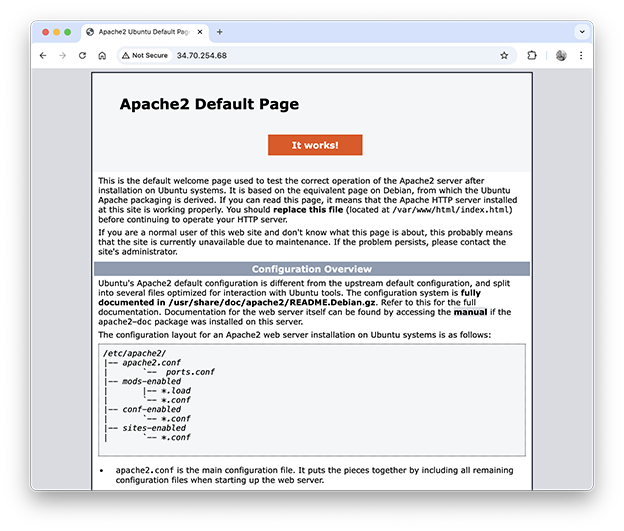

# PDFer

A basic API tool that creates PDFs from HTML or a URL.

> This application is currently live at:  
> https://pdfer.codeadam.ca

This tool uses a basic Laravel app with Browsershot and Puppeteer to generate PDFs. Here are the steps to create a new Google Cloud E2 server and install the necessary libraries.

1. Login to the [GCP Console](https://console.cloud.google.com/) and create a new E2 server using Ubuntu 22 LTS x86/64.
2. Change the IP address to a static IP.
3. Open up the GCP SSH tool and run a few update and upgrade commands:

    ```
    sudo apt update
    sudo apt upgrade
    sudo apt autoremove
    ```

4. Install Apache using these commannds:

    ```
    sudo apt install apt-utils 
    sudo apt install apache2 apache2-utils 
    sudo service apache2 restart
    ```

    At this point you can enter your IP address (use http://) into a browser and you should see the default Apache page:

    

6. Install and configure MySQL:

    ```
    sudo apt-get install mysql-server
    ```
    
7. Insall PHP:

    ```
    sudo apt update
    sudo add-apt-repository ppa:ondrej/apache2
    sudo add-apt-repository ppa:ondrej/php
    sudo apt install php8.3
    ```

    And all required PHP libraries:

    ```
    sudo apt-get install -y php8.3-cli php8.3-common php8.3-mysql php8.3-zip php8.3-gd
    sudo apt-get install -y php8.3-mbstring php8.3-curl php8.3-xml php8.3-bcmath
    ```
    
8.  Install [Composer](https://getcomposer.org/):

    ```
    curl -sS https://getcomposer.org/installer -o /tmp/composer-setup.php
    sudo php /tmp/composer-setup.php --install-dir=/usr/local/bin --filename=composer
    ```

    And confirm Composer is installed:

    ```
    compoer --version
    ```
    
9.  Install [GIT](https://git-scm.com/):

    ```
    sudo apt install git-all
    sudo apt-get install install-info
    ```

    And comfirm Git is installed:

    ```
    git --version
    ```

10.  Change the server password:

    ```
    sudo passwd
    sudo apt update
    sudo apt upgrade
    ```

    And reboot:

    ```
    sudo reboot
    ```

11.  Install [Webmin](https://webmin.com/):

    ```
    curl -fsSL https://download.webmin.com/jcameron-key.asc | sudo gpg --dearmor -o /usr/share/keyrings/webmin.gpg
    ```

    Then open up the `sources.list` file:

    ```
    sudo nano /etc/apt/sources.list
    ```

    And add this lkine to the ver bottom:

    ```
    deb [signed-by=/usr/share/keyrings/webmin.gpg] http://download.webmin.com/download/repository sarge contrib
    ```

    And intall Webmin:

    ```
    sudo apt update
    sudo apt install webmin
    ```
    
    Open up p[ort 10000:

    ```
    sudo ufw allow 10000
    ```

    And open port 10000 in the VPC Network GCP console.

    Reboot the server:

    ```
    sudo reboot
    ```
    
12. 

---

## Project Stack

This project uses [PHP](https://www.php.net/), [Laravel](https://www.php.net/manual/en/book.image.php), and [Browsershot](https://spatie.be/docs/browsershot/v4/introduction).

 

---

## Repo Resources

* [Laravel](https://laravel.com/)
* [Browsershot](https://spatie.be/docs/browsershot/v4/introduction)

<a href="https://codeadam.ca">

</a>
